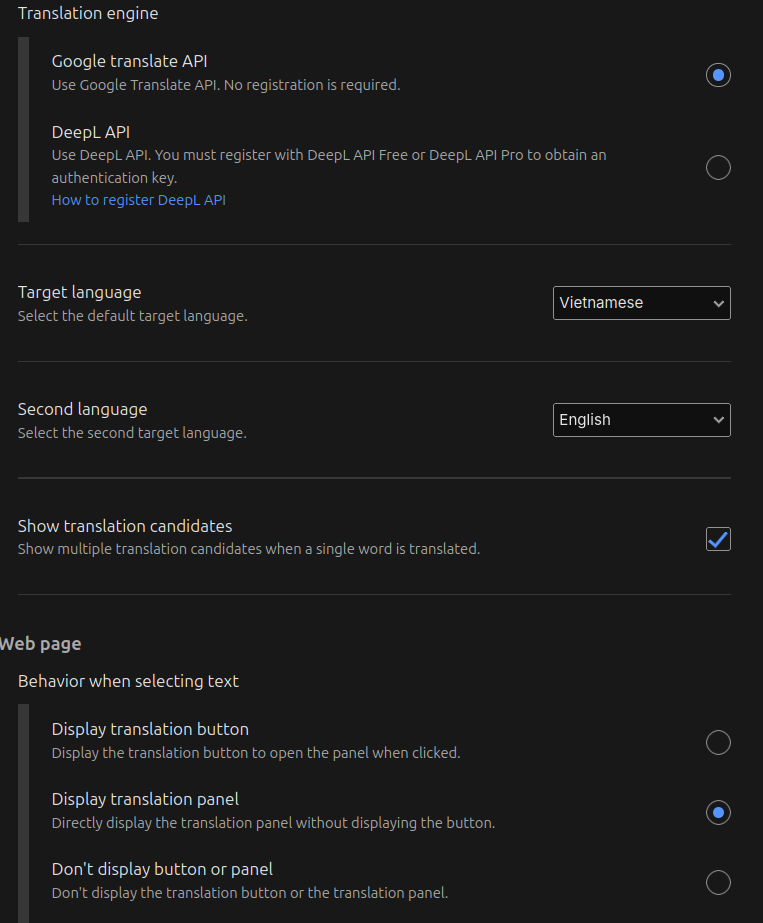
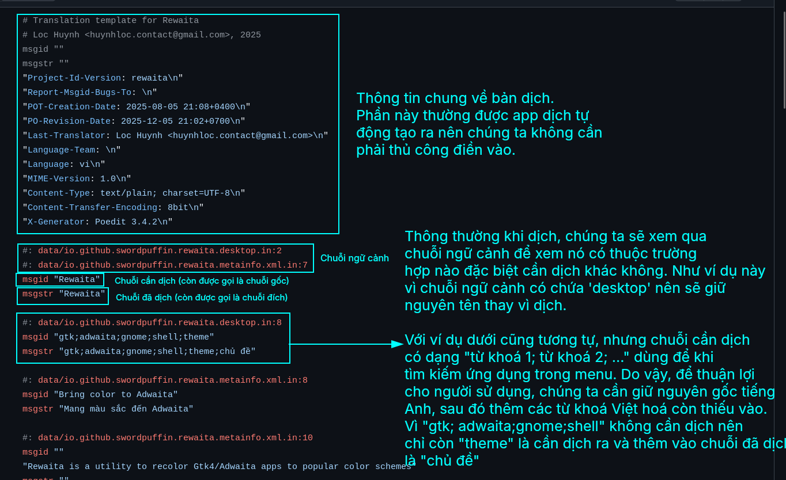
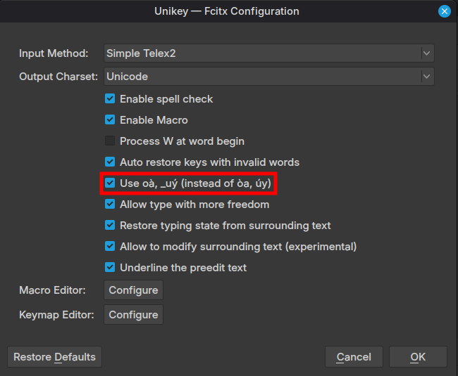

# Tổng quan
Hướng dẫn bắt đầu dịch tài liệu sang tiếng Việt dành cho người mới. Công cụ, quy tắc, từ điển thuật ngữ và ví dụ thực tế.

**TODO**:
- Thêm video cách dịch thực tế.
- Thêm nhiều ví dụ để dễ hình dung.

### Ứng dụng cần tải

- Visual Studio Code (cần cài tiện ích "Open in External App")
- Chọn 1 trong các phần mềm dịch PO (khuyên dùng bản Flatpak để luôn có bản mới nhất):  
  - Poedit  
  - Gtranslator (giao diện đơn giản nhất)  
  - Lokalize  
- Tra cứu thuật ngữ: TODO  
- Trình duyệt Chrome/Firefox → dùng Weblate online (cần cài tiện ích mở rộng "Simple Translate")

### Quy tắc dịch tiếng Việt
Nguồn chính: https://community.kde.org/KDE_Localization/vi/styleguide  
Mục này giúp mọi người dịch cùng một kiểu, tránh lộn xộn.

#### Các vấn đề đặc biệt cần nhớ

- **KDE**: Các chuỗi ngữ cảnh có chứa `X-KDE-Keywords` hoặc `Keywords` → đây là từ khóa tìm kiếm.  
  → Khi dịch **phải giữ nguyên chuỗi tiếng Anh** trong bản dịch.  
  → Ví dụ nguồn: `power,energy,battery`  
  → Dịch: `power,energy,batter,năng lượng,pin,nguồn điện`

- **GNOME**: Các chuỗi ngữ cảnh có chứa từ `desktop` → cũng là từ khóa tìm kiếm.  
  → Tương tự: để nguyên cụm tiếng Anh, sau đó thêm đoạn dịch tiếng Việt sau.  

#### Đánh vần

- **y và i**: Theo quy ước tại https://ngonngu.net/quyuoc/4  
  → Đặc biệt mục 2.4: Khi có phụ âm đầu + âm chính /i/ (không phải “uy”), dùng **i** thay vì **y**.  
  → Các từ thường gặp khi dịch Linux: **kí, kì, kĩ, kỉ, lí, bì, kì vọng, kĩ thuật…**

- **Đặt dấu thanh**: Theo kiểu mới (khuyến nghị của Bộ Giáo dục & hầu hết bộ gõ hiện đại)  
  → **oà, uý, uỳ, oe, ươu…** (dấu đặt trên chữ cái phát âm mạnh)  
  

#### Viết hoa

Không viết hoa theo nguồn tiếng Anh, chỉ viết hoa khi:

- Đầu câu (nếu nguồn cũng viết hoa đầu câu)  
- Tên riêng  
- Tên đầy đủ giấy phép (viết hoa đầu mỗi từ tiếng Việt)  
  → Ví dụ: **GNU General Public License** → **Giấy phép Công cộng Tổng quát GNU**  
- Tên thành phần + dùng ngoặc kép để làm rõ nghĩa (nếu cần)  
  → phần bổ sung (addon), phần mở rộng (extension), phần cài cắm (plugin), dụng cụ (engine)  

**Ví dụ**:  
Version Control Plugin for File Views  
→ Phần cài cắm “Quản lí phiên bản” cho khung xem tệp

> **Trường hợp đặc biệt**  
> “Activity” trong Plasma → luôn viết hoa **Hoạt động** (để phân biệt với hoạt động thông thường)

#### Viết số

- Phần thập phân: dấu phẩy → 3,14  
- Hàng nghìn: dấu cách → 1 000 000 (không dùng cho năm)  
- Phiên bản phần mềm: dấu chấm → 24.04.1

#### Viết tắt

- Không dịch các từ viết tắt phổ biến toàn cầu: KDE, GNU, GPL, URL, HTTP…  
  → Nếu nguồn có giải thích: dịch phần giải thích, giữ nguyên viết tắt.  
  → Ví dụ: Uniform Resource Locator (URL) → Mã định vị tài nguyên thống nhất (Uniform Resource Locator - URL)

> **Trường hợp đặc biệt**  
> SAR (Hồng Kông, Ma Cao) → dịch thành Đặc khu hành chính (vì ít người biết SAR)

- Bảng viết tắt tiếng Việt chuẩn: xem tại *Không thể truy cập được*

#### Viết đơn vị đo & tiền tố

Phiên âm tiền tố + dịch đơn vị:  
millisecond → mi-li giây  
kilobyte → KB (giữ nguyên nếu kèm số)

#### Dấu câu

Dùng đúng dấu nháy của nguồn:  
- Dấu nháy kép tiếng Anh → “…”  
- Dấu nháy đơn → ‘…’

### Các kênh liên lạc & trao đổi
[Tham gia Trello](https://trello.com/invite/b/693410e22376cc3504be953c/ATTI58145b7a72edb29857e031d4288fac0744222039/linux-l10n-hub)
[Trello Hub Chính](https://trello.com/b/CGulCDZa/linux-l10n-hub)

TODO [Discord]()